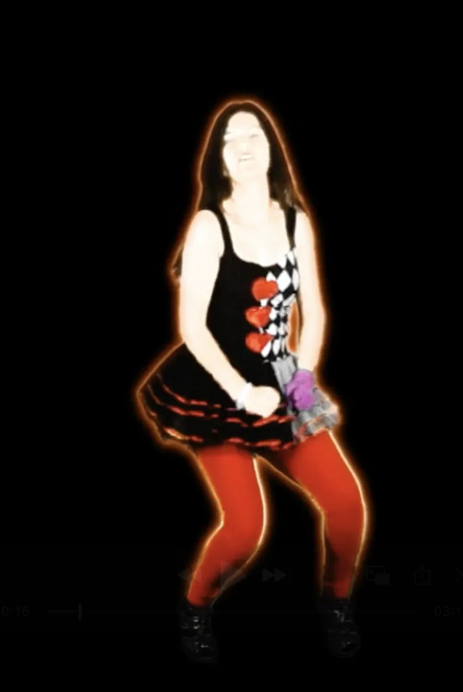
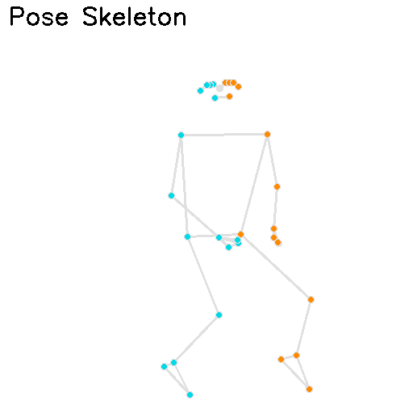
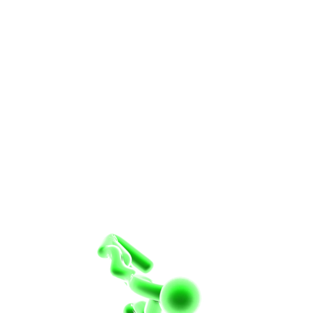

# Picto-AI

A simple script that creates a skeleton from a given dancer pose and attempts to turn it into a pictogram using a Blender model.
It uses MediaPipe to extract the dancer pose and then applies the pose data to a Blender rig to generate a skeleton.

**Pictogram model by VMMO22**

## Status
⚠ **Warning:** The script is currently not working as expected. While it successfully creates the skeleton, it fails to generate the pictogram due to issues with Blender rig bone names.

## Features
- ✅ Generates skeleton from dancer pose
- ❌ Pictogram creation not yet functional
- 🔧 Troubleshooting Blender rig bone name issues

## How to Run
Only tested on MacOS. Requires Blender 2.93 or higher.

Run the following commands to clone the project and run the script:
```
git clone https://github.com/yunylz/picto-ai.git
cd picto-ai
chmod +x process_dancer.sh
./process_dancer.sh test_pose.jpg
```

## Issues
I'm actively investigating the problem with Blender rig bone names and how they interfere with the script.

## Process Overview

| Dancer Pose           | Dancer Skeleton          | Pictogram Output        |
|-----------------------|-------------------------|-------------------------|
|  |  |  |